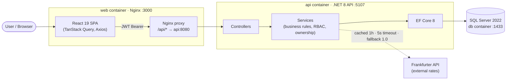

# Freelance Marketplace

> A simplified Upwork-style platform connecting **freelancers** with **clients** — job posting,
> proposals, file attachments, live currency conversion, and an admin dashboard. Full-stack
> .NET 8 + React, one-command Dockerized.

<!-- Build-status badge is a static placeholder — no CI pipeline is wired up for this capstone. -->


---

## 📽️ Demo & Screenshots

| Video | Audience | Link |
|-------|----------|------|
| **Technical walkthrough** (code, architecture, ADRs, AI log) | Engineers | <!-- LOOM: paste technical walkthrough URL here --> _link pending_ |
| **Product demo** (user journey + admin function) | Stakeholders | <!-- LOOM: paste product demo URL here --> _link pending_ |

> Recording scripts are committed at [`docs/technical-walkthrough-script.md`](docs/technical-walkthrough-script.md).
>
> _Screenshots:_ add UI captures to `docs/screenshots/` and embed them here, e.g.
> ``.

---

## 🏗️ Architecture Overview

A classic **three-tier** design. The browser talks only to the `web` container (React SPA behind
Nginx). Nginx serves static assets and reverse-proxies `/api/*` to the `api` container, which owns
all business logic and is the sole component that touches the database or the external currency
service. Authentication is **stateless JWT bearer**; authorization is enforced both by role
attributes on controllers and by ownership checks in the service layer.



📄 **Full diagrams** (component, login sequence, job→proposal flow, deployment) live in
[`architecture.md`](architecture.md). **Decision records** are in [`adr/`](adr/).

**Communication patterns**
- SPA ⇄ API: JSON over HTTP; `Authorization: Bearer <jwt>` on protected routes (401 if missing/invalid, 403 if wrong role).
- API ⇄ DB: EF Core over TDS (SQL Server).
- API ⇄ Frankfurter: outbound HTTPS, cached and timeout-bounded so an outage degrades gracefully.

---

## 🧰 Tech Stack

| Layer | Technology | Version |
|-------|-----------|---------|
| Backend runtime | .NET | 8.0 (`net8.0`) |
| ORM | EF Core (SqlServer + Design) | 8.0.11 |
| Auth | ASP.NET Core Identity · JWT Bearer | 8.0.11 |
| Validation | FluentValidation.AspNetCore | 11.3.0 |
| API docs | Swashbuckle (Swagger) | 6.6.2 |
| Frontend | React · React DOM | 19.2 |
| Build tool | Vite | 8.1 |
| Language | TypeScript | 6.0 |
| Data fetching | TanStack Query | 5.101 |
| Routing | React Router | 7.18 |
| HTTP client | Axios | 1.18 |
| Styling | Tailwind CSS | 3.4 |
| Database | SQL Server | 2022 |
| Testing | xUnit · FluentAssertions · Moq · coverlet | 2.5.3 · 6.12 · 4.20 · 6.0 |
| Orchestration | Docker Compose | v2 |
| Third-party API | [Frankfurter](https://www.frankfurter.app/) (keyless FX rates) | — |

---

## ✅ Prerequisites

**To run with Docker (recommended):**
- Docker Desktop (Compose v2)

**To run in dev mode (without full Docker):**
- .NET 8 SDK
- Node.js 18+
- A SQL Server instance (the snippet below runs one in Docker)

---

## 🚀 Quick Start (clean machine)

```bash
git clone https://github.com/ahad124/freelance-marketplace.git
cd freelance-marketplace
docker compose up --build
```

Then open **http://localhost:3000**.

> ⏳ On first run SQL Server takes ~30 s to initialise. The `api` container waits for the database
> health check before starting, so the initial boot is intentionally gated.

**Seeded admin account:**

| Role | Email | Password |
|------|-------|----------|
| Admin | `admin@demo.test` | `Password123!` |

Register your own Freelancer/Client accounts from the UI, or log in as the admin to explore the
dashboard.

---

## 🖥️ Running Locally (Dev Mode)

**Backend**
```bash
cd backend
# Start SQL Server
docker run -e "ACCEPT_EULA=Y" -e "MSSQL_SA_PASSWORD=Your_password123" \
  -p 1433:1433 -d mcr.microsoft.com/mssql/server:2022-latest

dotnet run --project src/FreelanceMarketplace.Api
# API → http://localhost:5107  ·  Swagger UI at /swagger
```

**Frontend**
```bash
cd frontend
npm install
npm run dev
# App → http://localhost:3000 (Vite proxies /api → :5107)
```

---

## ⚙️ Configuration

Configuration binds from `appsettings.json` and is overridden by environment variables (double
underscore `__` denotes nesting). **No secrets are committed for production** — inject them per
environment.

| Env variable | Bound setting | Example / default | Notes |
|--------------|---------------|-------------------|-------|
| `ConnectionStrings__Default` | DB connection | `Server=db,1433;Database=FreelanceMarketplace;User Id=sa;Password=...;TrustServerCertificate=True;` | Required |
| `Jwt__SigningKey` | `JwtOptions.SigningKey` | 32+ char secret | **Use this exact key** (see ⚠️ below) |
| `Jwt__Issuer` | `JwtOptions.Issuer` | `FreelanceMarketplace` | |
| `Jwt__Audience` | `JwtOptions.Audience` | `FreelanceMarketplace` | |
| `Jwt__AccessTokenMinutes` | token lifetime | `60` | |
| `Currency__BaseUrl` | Frankfurter base URL | `https://api.frankfurter.app` | |
| `Currency__TimeoutSeconds` | upstream timeout | `5` | |
| `Currency__CacheMinutes` | rate cache TTL | `60` | |
| `FileStorage__RootPath` | upload directory | `uploads` (mapped to `uploads` volume) | |
| `FileStorage__MaxBytes` | max upload size | `5242880` (5 MB) | |
| `Cors__AllowedOrigins__0` | allowed SPA origin | `http://localhost:3000` | |

> ⚠️ **Known configuration issue (ISS-01):** the committed `docker-compose.yml` sets `Jwt__Secret`,
> but the app binds **`Jwt__SigningKey`**. The compose value is currently ignored and the app falls
> back to the dev key in `appsettings.json`. Rename it to `Jwt__SigningKey` (and remove the dev key
> from source control) before any real deployment. Tracked in the [UAT report](uat-report.md).

---

## 🧪 Testing

```bash
cd backend
dotnet test
```

- **67 tests** — all green (unit + integration).
- **88.3% line coverage** (excluding auto-generated EF migrations and the design-time factory).

Generate an HTML coverage report:

```bash
dotnet test --collect:"XPlat Code Coverage" --results-directory ./TestResults
reportgenerator \
  -reports:"TestResults/**/coverage.cobertura.xml" \
  -targetdir:"TestResults/CoverageReport" \
  -reporttypes:Html \
  -classfilters:"-*.Data.Migrations.*;-*.DesignTimeDbContextFactory"
# Open TestResults/CoverageReport/index.html
```

**User Acceptance Testing:** the manual/acceptance suite and its results are documented in
[`uat-report.md`](uat-report.md) (22 cases, 22 passing). Each case is backed by a corresponding
automated test.

---

## 📦 Deployment Notes (local Docker)

`docker compose up --build` builds and runs three containers:

| Container | Image / build | Host port | Volume |
|-----------|---------------|-----------|--------|
| `freelance_db` | `mssql/server:2022-latest` | 1433 | `sqldata` (DB files) |
| `freelance_api` | `Dockerfile.api` (.NET 8) | 5107 → 8080 | `uploads` (attachments) |
| `freelance_web` | `Dockerfile.web` (React + Nginx) | 3000 → 80 | — |

- The API waits for `db` to be **healthy** (`depends_on: condition: service_healthy`) and retries the
  connection during SQL Server warm-up.
- `web` reverse-proxies `/api/*` to `api:8080`, so the SPA and API share one origin in the browser.
- Data survives restarts via the named volumes. To reset all data: `docker compose down -v`.

---

## 🤖 How This Was Built (AI collaboration)

This project was built with deliberate AI assistance across planning, implementation, testing, and
documentation. The **top 20 prompts** — with their phase, purpose, and honest outcomes
(accepted / modified / rejected) — are documented in
[`ai-collaboration-log.md`](ai-collaboration-log.md). Highlights include rejecting an AI-suggested
`400` in favour of a semantically correct `409 Conflict`, and independently re-verifying the coverage
figure rather than trusting the generated number.

---

## 📚 Documentation Index

| Document | Contents |
|----------|----------|
| [`architecture.md`](architecture.md) | Mermaid diagrams — component, login sequence, feature flow, deployment |
| [`adr/`](adr/) | Architecture Decision Records (EF Core, JWT/RBAC, layered services, currency) |
| [`uat-report.md`](uat-report.md) | UAT environment, 22 test cases, issue severity, sign-off |
| [`ai-collaboration-log.md`](ai-collaboration-log.md) | Top 20 AI prompts with purpose & outcome |
| [`SPECIFICATION.md`](SPECIFICATION.md) | Full spec, user stories, acceptance criteria, technical design |
| [`docs/technical-walkthrough-script.md`](docs/technical-walkthrough-script.md) | Loom video script |

---

## 🔌 API Reference

Base URL: `http://localhost:5107/api` · protected endpoints require `Authorization: Bearer <token>`.

| Method | Route | Auth | Description |
|--------|-------|------|-------------|
| POST | `/auth/register` | — | Register (Freelancer or Client only) |
| POST | `/auth/login` | — | Login, returns JWT |
| GET | `/auth/me` | ✓ | Current user profile |
| PUT | `/auth/profile` | ✓ | Update display name / currency / avatar |
| GET | `/jobs` | — | List jobs (search, category, budget filters) |
| POST | `/jobs` | Client | Create a job |
| GET | `/jobs/{id}` | — | Get job details |
| PUT | `/jobs/{id}` | Client (owner) | Update a job |
| DELETE | `/jobs/{id}` | Client (owner) | Delete a job |
| GET | `/jobs/{id}/proposals` | Client (owner) / Admin | List proposals for a job |
| POST | `/proposals` | Freelancer | Submit a proposal |
| GET | `/proposals/mine` | Freelancer | My proposals |
| PUT | `/proposals/{id}` | Freelancer (owner) | Edit a proposal |
| POST | `/proposals/{id}/withdraw` | Freelancer (owner) | Withdraw a proposal |
| DELETE | `/proposals/{id}` | Admin | Delete a proposal |
| POST | `/files` | ✓ | Upload a file (multipart) |
| GET | `/files/{id}` | ✓ | Download a file |
| GET | `/currency/convert` | — | Convert amount between currencies |
| GET | `/admin/metrics` | Admin | Platform KPIs (live DB counts) |
| GET | `/admin/users` | Admin | All users |
| POST | `/admin/users/{id}/role` | Admin | Change user role |
| POST | `/admin/users/{id}/toggle-status` | Admin | Suspend / enable account |

---

## 🗂️ Project Structure

```
freelance-marketplace/
├── backend/
│   ├── src/FreelanceMarketplace.Api/
│   │   ├── Controllers/   # Auth, Jobs, Proposals, Files, Currency, Admin, Contracts…
│   │   ├── Data/          # AppDbContext, DbSeeder, Migrations
│   │   ├── Dtos/          # Request/response records
│   │   ├── Entities/      # AppUser, Job, Proposal, Contract, Milestone, LedgerEntry
│   │   ├── Services/      # Business logic + interfaces
│   │   ├── Validation/    # FluentValidation validators
│   │   └── Middleware/    # Global exception handler
│   └── tests/FreelanceMarketplace.Tests/   # Unit + Integration (xUnit)
├── frontend/src/          # components, context, utils, views
├── adr/                   # Architecture Decision Records
├── docs/                  # spec source, UAT source, prompts source, video script
├── architecture.md        # Mermaid diagrams
├── uat-report.md          # UAT report
├── ai-collaboration-log.md
├── Dockerfile.api · Dockerfile.web · docker-compose.yml
```

---

## 📄 Licence

This is an **educational capstone project** — all rights reserved. Not licensed for redistribution
or production use. (No OSI licence is applied.)
