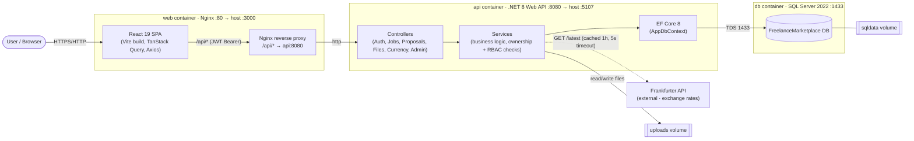
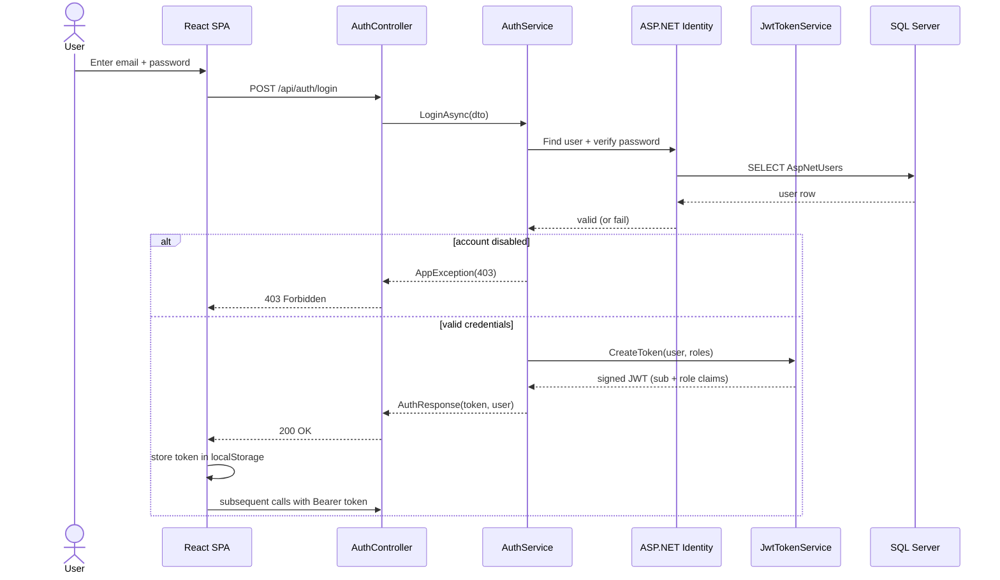
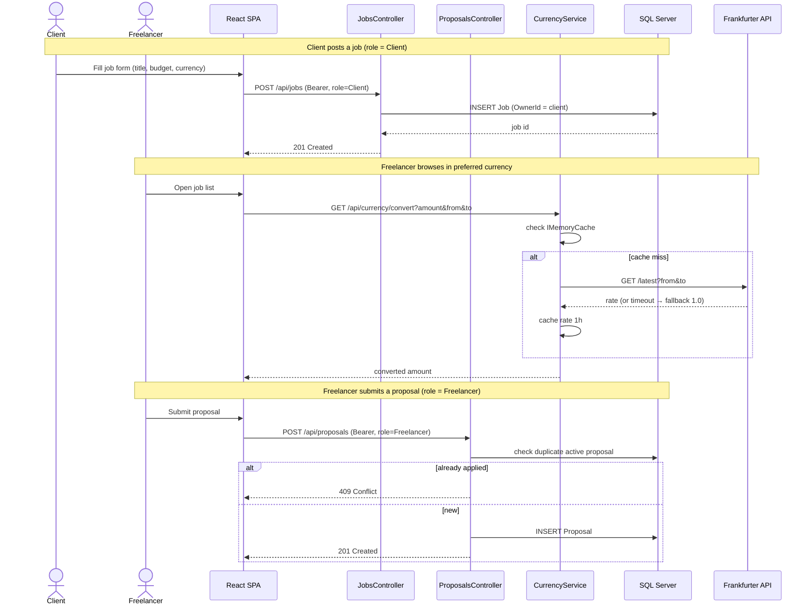
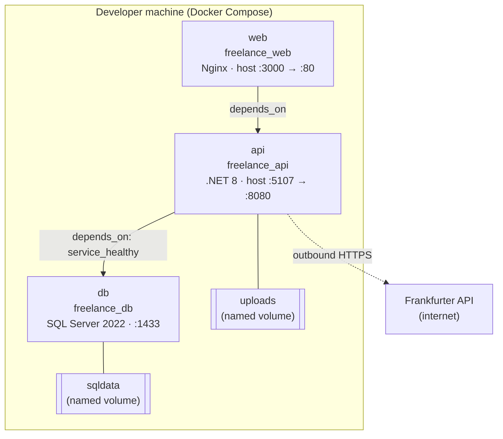

# Architecture — Freelance Marketplace

This document describes the system architecture of the Freelance Marketplace platform: its
high-level components, the data flow for two key scenarios (authentication and the
core post-job → proposal journey), and the containerised deployment view.

All diagrams below are written in [Mermaid](https://mermaid.js.org/) and render natively in
GitHub's Markdown viewer.

---

## 1. Component / Container View

A classic three-tier design. The browser talks only to the `web` container (React SPA served
by Nginx). Nginx serves static assets and reverse-proxies every `/api/*` request to the `api`
container, which owns all business logic and is the only component that touches the database or
the external currency service.

**Key design decisions** (see [`adr/`](adr/) for the full records):

- **Thin controllers, fat services** — controllers only bind DTOs and translate results to HTTP
  status codes; all business rules, ownership checks, and role enforcement live in the service
  layer ([ADR-003](adr/003-layered-service-architecture.md)).
- **Stateless JWT auth** — no server session state, so the `api` container scales horizontally
  ([ADR-002](adr/002-jwt-bearer-auth-with-aspnet-identity.md)).
- **Resilient external calls** — the currency integration caches results and degrades gracefully
  to a 1.0 rate on failure, so a third-party outage never breaks job browsing
  ([ADR-004](adr/004-resilient-external-currency-integration.md)).

---

## 2. Authentication Flow (Login)

JWT bearer authentication. On success the SPA stores the token and attaches it as an
`Authorization: Bearer <token>` header (via an Axios interceptor) on every subsequent request.
Protected endpoints return **401** when the token is missing/invalid and **403** when the role
is insufficient.

---

## 3. Core Feature Flow — Post a Job → Submit a Proposal

The platform's primary journey spans both roles and shows RBAC, ownership checks, and the live
currency conversion working together.

---

## 4. Deployment View

`docker compose up --build` orchestrates three containers on a shared Compose network with two
named volumes for persistence. The `api` container waits for the database health check to pass
before starting; both `api` and `web` restart on failure.

**Ports:** `3000` (web) · `5107` (api) · `1433` (db).
**Volumes:** `sqldata` (database files) · `uploads` (user-uploaded attachments).
